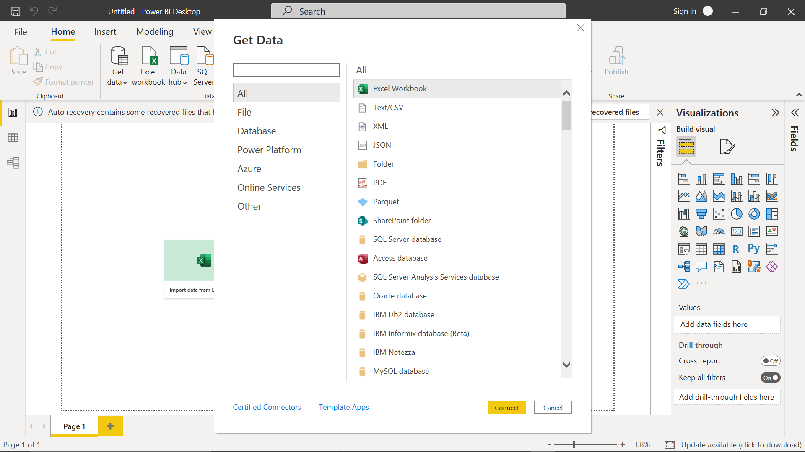
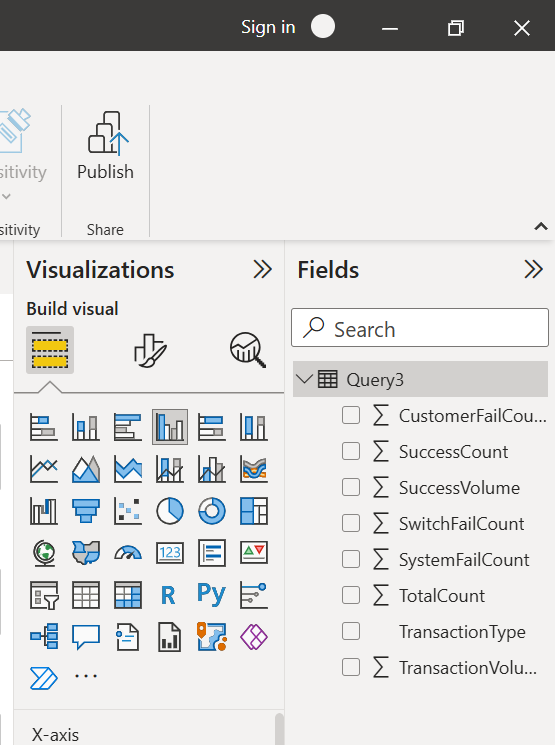

### **03-powerbi-connection.md**
---
#### Step 1: Open Power BI Desktop

Launch Power BI Desktop and head to **Home → Get Data → SQL Server**.

>screenshot here: Get Data window

---

#### Step 2: Connect to SQL Server

* In **Server**, type in your SQL Server name (e.g., `localhost` or the instance name).
* In **Database**, type the name where your `Transactions` table lives.
* Click **OK**.

---

#### Step 3: Use Direct Query or Import

Choose **DirectQuery** (keeps live connection) or **Import** (pulls static data).
For daily reports, **DirectQuery** is often better since it fetches fresh results each time.

---

#### Step 4: Enter SQL Query

Instead of importing the whole table, select **Advanced options → SQL statement**.
Then paste the query from the previous step.

---

#### Step 5: Load Data

Click **OK → Load**.
Your summarized table should now appear in Power BI under **Fields**.

---

Next step after this is **building visuals** (bar charts, pie charts, cards, etc.) to showcase:

* Total transactions per type
* Success vs Failure counts
* Breakdown by failure type

---
