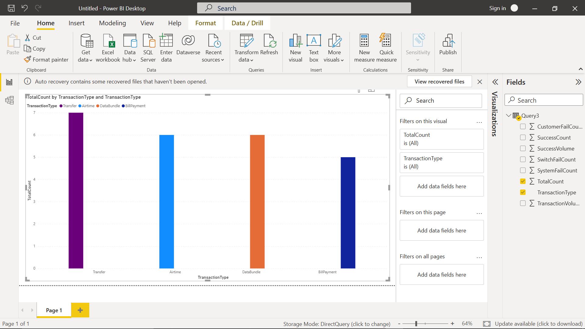
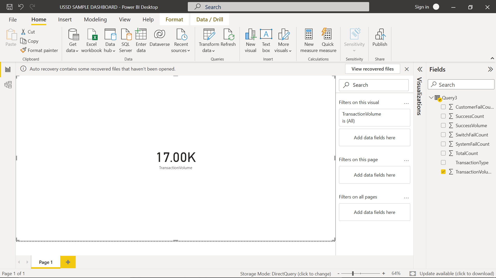
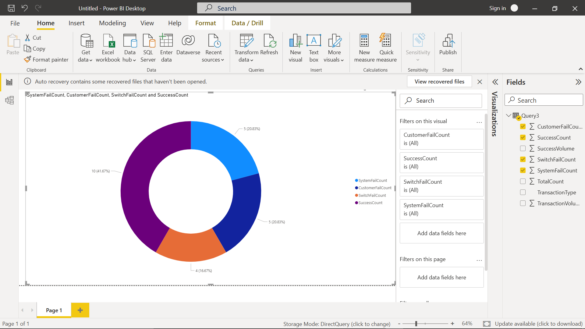
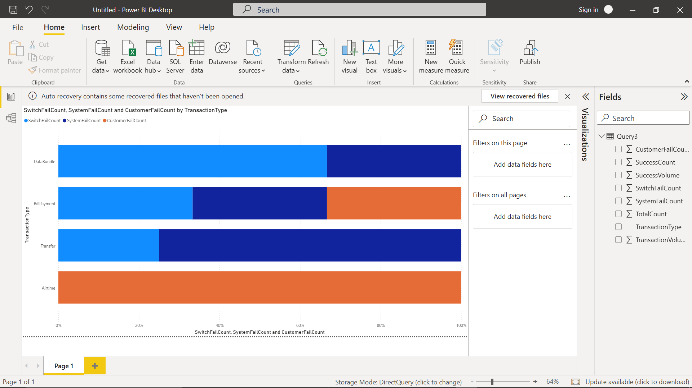

# **04-visuals.md**
---

With the query loaded into Power BI, we can create visuals to make transaction patterns easier to understand at a glance.

>⚠️ Note: The visuals in this project are for demonstration purposes only. 
They show how the data can be represented but are not fully polished dashboards you would see in production. Their main goal is to illustrate the process of turning SQL query results into charts and cards.
---

### **1. Total Transactions per Type**

* Use a **Clustered Column Chart**.
* **Axis** → TransactionType
* **Values** → TotalCount

>(screenshot: column chart showing counts per transaction type)

---

### **2. Transaction Volume**

* Use a **Card visual** to display the total **TransactionVolume**.
* This gives management a one-glance idea of the day’s money flow.

>(screenshot: card showing ₦ value of transactions)

---

### **3. Success vs Failures**

* Use a **Pie Chart** or **Donut Chart**.
* **Values** → SuccessCount + (CustomerFailCount + SwitchFailCount + SystemFailCount)
* **Legend** → Category (Success, Failure)

>(screenshot: donut chart splitting Success vs Failure)

---

### **4. Breakdown of Failures**

* Use a **Stacked Bar Chart**.
* **Axis** → TransactionType
* **Values** → CustomerFailCount, SwitchFailCount, SystemFailCount
* This shows not just how many failed, but *why* they failed.

>(screenshot: stacked bar chart with failure categories)

---

### Why This Dashboard Works

This dashboard isn’t just pretty—it gives at-a-glance insight into:

* Which transaction types dominate the platform.
* How reliable the system is.
* Whether failures are coming from customers, switches, or system errors.

